# Nourish

AI-assisted nutrition tracking that turns confirmed meals into a reusable personal food library.

[](https://nextjs.org/)
[](https://react.dev/)
[](https://supabase.com/)
[](https://ai.google.dev/)
[](https://vercel.com/)

Nourish helps users log meals from photos, review AI-estimated nutrition, and save confirmed meals as personal templates. Meals such as “Mom's Chicken Biryani,” “Office Lunch,” or “Breakfast Oats” become one-click shortcuts, improving logging speed while reducing repeated AI requests and cost.

## Current capabilities

- Email/password authentication through Supabase Auth
- Google OAuth through Supabase Auth
- Protected Next.js dashboard and authenticated API routes
- Direct meal-photo uploads to a private Supabase Storage bucket
- Gemini multimodal analysis using the provided sports-nutrition prompt
- Structured and runtime-validated nutrition output
- Calories, protein, carbohydrates, fat, sugar, fiber, and sodium estimates
- Overall confidence score and friendly dietitian guidance
- Editable meal confirmation before saving
- Personal Foods library with usage count and last-used tracking
- One-click logging for previously confirmed foods
- Delete saved Personal Foods
- Per-user PostgreSQL and Storage Row Level Security
- Responsive light and dark interfaces

> The current dashboard contains representative daily and weekly visualization data. Persistent meal history, calculated user targets, and fully dynamic daily summaries are planned modules.

## How meal analysis works

```mermaid
flowchart LR
    A["Authenticated user"] --> B["Private Supabase Storage"]
    B --> C["Next.js analysis API"]
    C --> D["Validate ownership, size, and image signature"]
    D --> E["Gemini 3.1 Flash-Lite"]
    E --> F["Zod-validated nutrition JSON"]
    F --> G["Editable confirmation"]
    G --> H["Personal Foods template"]
    H --> I["One-click future logging"]
```



Images upload directly from the browser to Supabase Storage. The browser then sends only the private storage path to the application API, avoiding large image bodies through the Vercel function. The API verifies the authenticated user owns the path, downloads the image through the user's Supabase session, validates its real file signature, and sends it to Gemini from the server.

## Technology

| Layer | Technology |
| --- | --- |
| Application | Next.js 16 App Router, React 19, TypeScript |
| Styling | Tailwind CSS 4 |
| Authentication | Supabase Auth and SSR cookie sessions |
| Database | Supabase PostgreSQL |
| File storage | Private Supabase Storage |
| AI | Google Gen AI SDK, Gemini 3.1 Flash-Lite |
| Validation | Zod |
| Hosting | Vercel |
| Testing | Node.js test runner, ESLint, Next.js production build |

Dependencies are pinned in `package.json` and `package-lock.json` for reproducible builds.

## Repository structure

```text
app/
├── api/
│   ├── food-templates/       Personal Foods API
│   └── meals/analyze/        Authenticated Gemini analysis API
├── auth/                     OAuth callback and sign-out routes
├── login/                    Authentication interface
├── nutrition-dashboard.tsx   Dashboard, upload, editor, and library UI
├── layout.tsx
└── page.tsx
database/
├── supabase_personal_foods.sql
└── supabase_meal_images.sql
lib/
├── ai/                       Prompt, schema, and Gemini service
└── supabase/                 Browser, server, and proxy clients
public/
tests/
proxy.ts                      Supabase session refresh
```

## Prerequisites

- Node.js 22.13 or newer
- npm
- A Supabase project
- A Gemini API key from [Google AI Studio](https://aistudio.google.com/app/apikey)
- A Vercel account for production deployment

## Environment variables

Copy the example file:

```bash
cp .env.example .env.local
```

On Windows PowerShell:

```powershell
Copy-Item .env.example .env.local
```

Configure the following values:

| Variable | Exposure | Description |
| --- | --- | --- |
| `NEXT_PUBLIC_SUPABASE_URL` | Browser-safe | Supabase project URL |
| `NEXT_PUBLIC_SUPABASE_PUBLISHABLE_KEY` | Browser-safe | Supabase publishable key |
| `NEXT_PUBLIC_SITE_URL` | Browser-safe | Canonical local or production URL |
| `GEMINI_API_KEY` | Server-only | Gemini API authorization key |
| `GEMINI_MODEL` | Server-only | Optional model override; defaults to `gemini-3.1-flash-lite` |

Never prefix the Gemini key or a Supabase secret/service-role key with `NEXT_PUBLIC_`. Never commit `.env` or `.env.local`.

## Supabase setup

### 1. Apply the database scripts

Open **Supabase Dashboard → SQL Editor**, then run these files in order:

1. `database/supabase_personal_foods.sql`
2. `database/supabase_meal_images.sql`

The first script creates:

- `public.food_templates`
- Ownership-based RLS policies
- `upsert_food_template` RPC
- `log_food_template` RPC
- Authenticated-role grants

The second script creates:

- Private `meal-images` bucket
- 8 MB upload limit
- JPEG, PNG, and WebP allowlist
- Per-user folder policies for select, insert, update, and delete

Uploaded objects use this ownership structure:

```text
meal-images/{authenticated-user-id}/{random-uuid}.{extension}
```

### 2. Configure authentication URLs

In **Supabase Dashboard → Authentication → URL Configuration**, set:

- Site URL for the production domain
- `http://localhost:3000/auth/callback`
- `https://YOUR_DOMAIN/auth/callback`

### 3. Enable Google OAuth (optional)

Create a Google OAuth client, enable the Google provider in Supabase Auth, and add the callback URL displayed by Supabase to the Google Cloud OAuth configuration.

Email/password authentication works without Google OAuth.

## Local development

Install dependencies:

```bash
npm install
```

Start the application:

```bash
npm run dev
```

Open [http://localhost:3000](http://localhost:3000).

The project uses Webpack mode because some managed Windows environments block native SWC/Turbopack binaries. Vercel supports this build configuration.

## Available commands

| Command | Purpose |
| --- | --- |
| `npm run dev` | Start the local development server |
| `npm run build` | Create a production Next.js build |
| `npm start` | Run the production build |
| `npm run lint` | Run ESLint |
| `npm test` | Build the app and run contract tests |

## API routes

| Method | Route | Authentication | Purpose |
| --- | --- | --- | --- |
| `GET` | `/api/food-templates` | Required | List the user's Personal Foods |
| `POST` | `/api/food-templates` | Required | Confirm and upsert a food template |
| `PATCH` | `/api/food-templates` | Required | Increment usage for one-click logging |
| `DELETE` | `/api/food-templates` | Required | Delete a saved Personal Food |
| `POST` | `/api/meals/analyze` | Required | Analyze a private uploaded meal image |
| `GET` | `/auth/callback` | OAuth flow | Exchange the Supabase OAuth code |
| `POST` | `/auth/signout` | Required | End the current session |

### Analyze a meal

The client first uploads an image to the authenticated user's private folder, then calls:

```json
{
  "path": "USER_UUID/IMAGE_UUID.jpg"
}
```

Successful analysis returns:

```json
{
  "analysis": {
    "items": [],
    "total_summary": {
      "calories": 0,
      "protein_g": 0,
      "carbs_g": 0,
      "fat_g": 0,
      "sugar_g": 0,
      "fiber_g": 0,
      "sodium_mg": 0
    },
    "dietitian_tip": "",
    "confidence_overall": 0
  },
  "imagePath": "USER_UUID/IMAGE_UUID.jpg"
}
```

## Security design

- Authenticated server routes revalidate Supabase claims
- PostgreSQL RLS isolates every user's templates
- Storage policies isolate every user's image folder
- The Gemini key is read only by server-side code
- No service-role key is required by the application
- AI responses are validated with Zod before reaching the UI
- Image type is checked using file bytes, not only client metadata
- Image size and accepted MIME types are enforced by both application code and Storage
- Failed or invalid analyses remove their uploaded object
- RPC functions use `SECURITY INVOKER`, preserving RLS
- Dependencies and lockfiles are pinned

## Deploying to Vercel

1. Import `AmmarBinYasir489/calories-counter` into Vercel.
2. Keep the framework preset as **Next.js**.
3. Add all four variables from `.env.example`.
4. Scope production secrets to the Production environment.
5. Set `NEXT_PUBLIC_SITE_URL` to the final HTTPS domain.
6. Deploy.
7. Add the Vercel domain and custom domain callback URLs to Supabase Auth.
8. Redeploy after changing environment variables.

The GitHub `main` branch is suitable for Vercel automatic deployments.

## Verification

Before releasing:

```bash
npm run lint
npm test
npm audit --omit=dev
```

The current production build includes:

- Authenticated dashboard
- Personal Foods API
- Gemini meal-analysis API
- Supabase session proxy
- Login, OAuth callback, and sign-out routes

## Roadmap

- User profiles and scientifically calculated BMI, BMR, TDEE, and macro targets
- Persistent meal logs, meal items, and daily summaries
- Calendar, daily, and weekly meal history
- Health-condition-aware nutrition alerts
- Manual food search and custom foods
- Barcode, restaurant, recipe, and voice logging
- Weekly and monthly reports
- AI nutrition coach
- Workout and wearable integrations
- Subscriptions, family accounts, reminders, and gamification

## Nutrition and medical disclaimer

AI nutrition estimates are approximate and depend on image quality, visible ingredients, portion ambiguity, and preparation method. Nourish is intended for general wellness tracking and is not a substitute for medical advice, diagnosis, or treatment. Users with medical conditions should review dietary decisions with a qualified healthcare professional.

## Contributing

Keep changes focused, type-safe, and covered by the available checks. Preserve RLS boundaries, keep privileged keys server-side, and update this README whenever setup requirements or supported features change.
